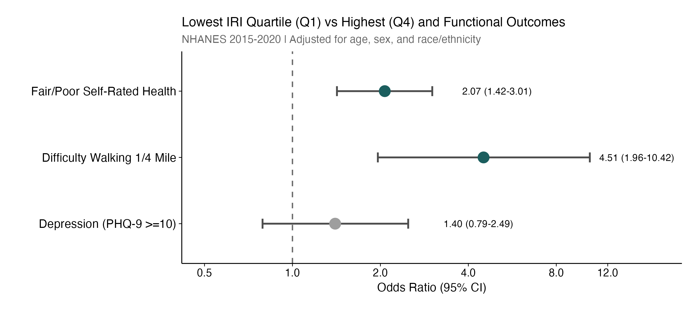
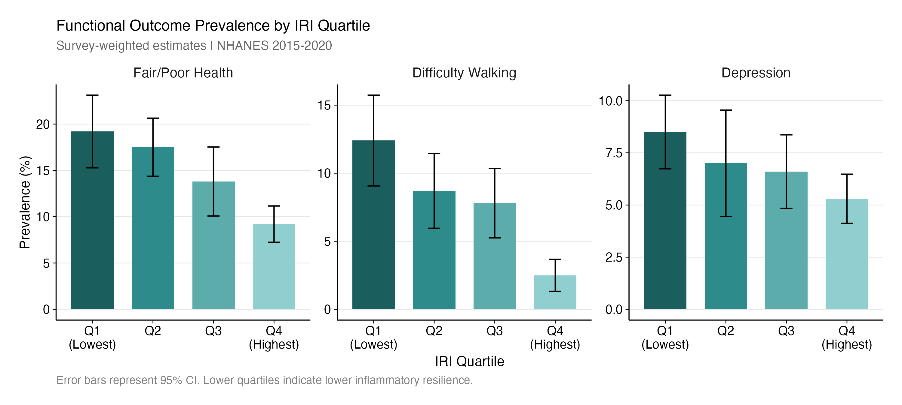
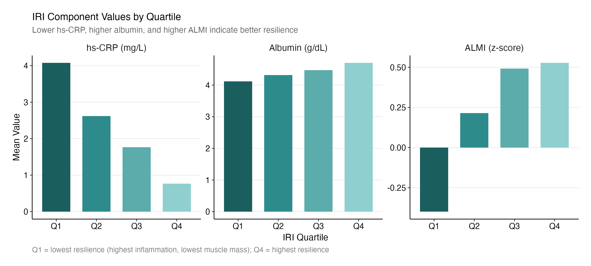

# Inflammatory Resilience Index Combining hs-CRP, Albumin, and Appendicular Lean Mass Predicts Functional Limitations and Self-Rated Health in U.S. Adults: NHANES 2015-2020

---

## CLINICAL PERSPECTIVES

What Is Known: Inflammation, nutritional status, and muscle mass independently predict adverse health outcomes. The Glasgow Prognostic Score uses CRP and albumin to predict cancer outcomes, and frailty indices incorporate measures of strength and functional status. However, a simple composite specifically integrating inflammation, nutrition, and objective muscle mass measurement has not been widely evaluated in population-based samples.

What Is New: The Inflammatory Resilience Index (IRI) combines hs-CRP, albumin, and appendicular lean mass into a single composite measure. Compared with the highest IRI quartile, the lowest quartile had approximately 2-fold higher odds of fair/poor self-rated health and approximately 4.5-fold higher odds of walking difficulty. These associations persist after adjustment for age, sex, and race/ethnicity.

Clinical Implications: IRI captures integrated physiologic resilience across inflammation, nutrition, and muscle mass domains. This exploratory index warrants validation in prospective cohorts with hard clinical endpoints before clinical implementation.

---

## ABSTRACT

BACKGROUND: Inflammation, nutritional status, and muscle mass independently predict adverse health outcomes. An integrated index combining these domains may better capture overall physiologic resilience than individual biomarkers.

OBJECTIVES: To develop an Inflammatory Resilience Index (IRI) combining high-sensitivity C-reactive protein (hs-CRP), serum albumin, and appendicular lean mass index (ALMI), and evaluate its association with functional outcomes in U.S. adults.

METHODS: Using NHANES 2015-2020 with dual-energy X-ray absorptiometry (DEXA) data, we constructed the IRI as: (−z_hs-CRP) + z_Albumin + z_ALMI, where higher values indicate better resilience. Among 2,729 adults aged ≥20 years with complete data, we examined associations between IRI quartiles and functional outcomes (fair/poor self-rated health, difficulty walking one-quarter mile, depression [PHQ-9 ≥10]) using survey-weighted logistic regression adjusted for age, sex, and race/ethnicity.

RESULTS: The IRI ranged from -5.2 to 5.2 (mean 0.74 ± 1.48). Participants in the lowest IRI quartile (Q1) were older (42.3 vs 34.3 years), more often female (68.6% vs 25.1%), had higher hs-CRP (4.08 vs 0.77 mg/L), lower albumin (4.12 vs 4.70 g/dL), and lower ALMI z-scores (-0.40 vs 0.53) compared to Q4. The prevalence of fair/poor health decreased from 19.2% (Q1) to 9.2% (Q4), and difficulty walking from 12.4% to 2.5%. In adjusted models, each 1-unit IRI increase was associated with 19% lower odds of fair/poor health (OR: 0.81; 95% CI: 0.74-0.89; P<0.001) and 22% lower odds of walking difficulty (OR: 0.78; 95% CI: 0.67-0.91; P=0.005). Comparing Q1 to Q4, odds were 2.07-fold higher for fair/poor health (95% CI: 1.42-3.01; P=0.004) and 4.51-fold higher for walking difficulty (95% CI: 1.96-10.42; P=0.006).

CONCLUSIONS: A novel Inflammatory Resilience Index integrating inflammation, nutritional reserve, and muscle mass is significantly associated with self-rated health and mobility limitations in U.S. adults. Lower IRI identifies individuals with substantially higher odds of poor functional outcomes, supporting its potential utility as a composite marker of physiologic reserve.

Keywords: Inflammation; C-reactive protein; albumin; sarcopenia; functional status; NHANES

---

## INTRODUCTION

Systemic inflammation, nutritional status, and skeletal muscle mass represent three interconnected physiologic domains that independently predict adverse health outcomes including mortality, cardiovascular disease, and functional decline.¹⁻³ High-sensitivity C-reactive protein (hs-CRP), a marker of low-grade systemic inflammation, is associated with increased cardiovascular risk even after adjustment for traditional risk factors.⁴ Serum albumin, reflecting both hepatic synthetic function and nutritional adequacy, predicts mortality across diverse populations.⁵ Appendicular lean mass, a measure of skeletal muscle, declines with aging and is a key component of sarcopenia and frailty syndromes.⁶

While each biomarker provides prognostic information independently, the interplay between inflammation, nutrition, and muscle mass suggests that integrated assessment may better capture overall physiologic resilience. Chronic inflammation promotes catabolism and muscle wasting; malnutrition impairs immune function and muscle protein synthesis; and sarcopenia is associated with increased inflammatory markers.⁷⁻⁹ This bidirectional relationship creates a vicious cycle that accelerates functional decline in vulnerable individuals.

Previous composite indices have combined subsets of these domains. The Glasgow Prognostic Score uses CRP and albumin to predict cancer outcomes.¹⁰ Frailty indices incorporate measures of strength, nutrition, and functional status.¹¹ However, a simple composite specifically integrating inflammation, nutrition, and objective muscle mass measurement has not been widely evaluated in population-based samples.

We hypothesized that an Inflammatory Resilience Index (IRI) combining hs-CRP, serum albumin, and appendicular lean mass index (ALMI) from dual-energy X-ray absorptiometry (DEXA) would identify individuals with poor self-rated health and functional limitations. Using nationally representative data from NHANES 2015-2020, we aimed to construct the IRI as a simple additive z-score composite, characterize the demographic and clinical profiles of adults across IRI quartiles, and evaluate associations between IRI and functional outcomes including self-rated health, mobility limitations, and depressive symptoms.

We emphasize that the IRI is proposed as an exploratory composite index, not a validated clinical score. This analysis represents an initial step toward understanding whether integrated assessment of these three domains provides incremental information beyond individual biomarkers.

---

## METHODS

### Data Source and Study Population

This analysis used data from the National Health and Nutrition Examination Survey (NHANES), a nationally representative survey of the civilian, non-institutionalized U.S. population conducted by the National Center for Health Statistics.¹² NHANES employs a complex, multistage probability sampling design with oversampling of certain subgroups to ensure reliable estimates. Participants undergo standardized interviews, physical examinations, and laboratory assessments.

We combined data from NHANES cycles 2015-2016 and 2017-2020 (pre-pandemic), which include DEXA body composition measurements. The analytic sample included adults aged ≥20 years with complete data for hs-CRP (≤10 mg/L, to exclude acute infection), serum albumin, and DEXA-derived appendicular lean mass. Participants with hs-CRP >10 mg/L were excluded to focus on chronic low-grade inflammation rather than acute infectious or inflammatory conditions.¹³ The final eligible cohort included 2,729 participants with complete IRI components and functional outcome data.

### Inflammatory Resilience Index Construction

The IRI was constructed as an additive composite of three standardized components:

IRI = (−z_hs-CRP) + z_Albumin + z_ALMI

In this formulation, z_hs-CRP represents log-transformed hs-CRP standardized within the analytic sample and inverted so that lower inflammation yields higher scores; z_Albumin represents serum albumin standardized within the analytic sample; and z_ALMI represents appendicular lean mass index standardized within sex (sex-specific z-scores).

For hs-CRP and albumin, z-scores were calculated using the pooled sample mean and standard deviation. For ALMI, sex-specific standardization was used to account for known differences in muscle mass between men and women. Higher IRI values indicate better inflammatory resilience (lower inflammation, higher albumin, greater muscle mass). This formulation assigns equal weight to each domain and is designed for simplicity and interpretability. The composite IRI was not re-centered after construction; thus, the sample mean deviates slightly from zero due to eligibility restrictions and missing data patterns.

### Component Measurements

hs-CRP was measured in serum using latex-enhanced nephelometry at a central laboratory. Values were reported in mg/L. Participants with hs-CRP >10 mg/L were excluded per American Heart Association guidelines for cardiovascular risk assessment.¹³

Serum albumin was measured using the bromocresol purple method in the standard NHANES biochemistry panel. Values were reported in g/dL.

ALMI was calculated from whole-body DEXA scans (Hologic Discovery model A). Appendicular lean mass was defined as the sum of lean soft tissue mass in the arms and legs, excluding bone mineral content. ALMI was calculated as appendicular lean mass (kg) divided by height squared (m²). For the IRI, ALMI was converted to sex-specific z-scores (standardized separately within men and women) to account for known sex differences in muscle mass while facilitating combination with other index components.

### Functional Outcomes

Primary outcomes were obtained from NHANES questionnaire data. For self-rated health, participants rated their general health as excellent, very good, good, fair, or poor; we created a binary outcome for fair/poor health versus excellent/very good/good. For mobility limitation, participants reported difficulty walking a quarter mile; those reporting some difficulty, much difficulty, or unable to do were classified as having walking difficulty. For depression, the Patient Health Questionnaire-9 (PHQ-9) was administered, and a score ≥10 was used to identify moderate-to-severe depressive symptoms, consistent with standard clinical cutoffs.¹⁴

### Covariates

Demographic variables included age (continuous), sex (male/female), and race/ethnicity (categorized as non-Hispanic White, non-Hispanic Black, Mexican American, other Hispanic, Asian, and other/multiracial). Additional covariates for sensitivity analyses included body mass index (BMI), diabetes (defined as HbA1c ≥6.5%, self-reported diabetes, or diabetes medication use), hypertension (average systolic BP ≥130 mmHg, diastolic BP ≥80 mmHg, or antihypertensive medication use), and current smoking status.

### Statistical Analysis

All analyses incorporated NHANES survey weights, strata, and primary sampling units to account for the complex survey design. Examination weights were scaled for combined cycles per NCHS guidelines.¹⁵ Because DEXA is performed in a subsample of examined participants, estimates are nationally representative of U.S. adults eligible for and completing DEXA body composition assessment; older adults and those with mobility limitations may be underrepresented.

Baseline characteristics were compared across IRI quartiles using survey-weighted means and proportions. P-values for trend were obtained from Wald tests in survey-adjusted regression models with IRI quartile as an ordinal predictor.

Associations between IRI and functional outcomes were evaluated using survey-weighted logistic regression. Three modeling approaches were used: continuous IRI (odds ratio per 1-unit increase in IRI), quartile analysis (odds ratios for Q1, Q2, and Q3 compared to Q4, highest resilience, reference), and sensitivity analysis (fully adjusted models including BMI, diabetes, hypertension, and smoking).

Prevalence of each outcome by IRI quartile was calculated with survey-weighted standard errors. A two-sided P-value <0.05 was considered statistically significant. Analyses were performed using R version 4.3 with the survey package.¹⁶

---

## RESULTS

### Study Population

Of 25,531 NHANES 2015-2020 participants, 2,729 adults aged ≥20 years met eligibility criteria with complete IRI components (hs-CRP ≤10 mg/L, albumin, and DEXA-derived ALMI). The mean age was 39.6 ± 11.4 years, 48.6% were female, and the racial/ethnic distribution was 61.5% non-Hispanic White, 11.0% non-Hispanic Black, 8.4% Mexican American, 10.8% Asian, and 8.3% other.

The IRI ranged from -5.16 to 5.24, with a mean of 0.74 (SD 1.48). Quartile boundaries were: Q1 (≤-0.28, lowest resilience), Q2 (-0.28 to 0.83), Q3 (0.83 to 1.90), and Q4 (>1.90, highest resilience).

### Characteristics by IRI Quartile

Participants in the lowest IRI quartile (Q1) differed substantially from those in the highest quartile (Q4) (Table 1). Regarding demographics, Q1 participants were older (42.3 vs 34.3 years, P<0.001), had more females (68.6% vs 25.1%, P<0.001), and higher BMI (29.5 vs 27.4 kg/m², P<0.001).

For IRI components, hs-CRP was 5.3-fold higher in Q1 (4.08 vs 0.77 mg/L, P<0.001), albumin was lower in Q1 (4.12 vs 4.70 g/dL, P<0.001), and ALMI z-score was lower in Q1 (-0.40 vs 0.53, P<0.001). The IRI component profiles by quartile are illustrated in Figure 3.

Regarding comorbidities, diabetes was more prevalent in Q1 (15.6% vs 5.7%, P<0.001), hypertension was similar across quartiles (approximately 35-41%, P=0.20), CVD history was numerically higher in Q1 (5.4% vs 2.3%, P=0.12), and current smoking was more prevalent in Q1 (25.8% vs 16.5%, P=0.03).

### Functional Outcomes by IRI Quartile

Clear gradients in functional outcome prevalence were observed across IRI quartiles (Table 2, Figure 2). For fair/poor self-rated health, prevalence was 19.2% (SE 2.0%) in Q1, 17.5% (SE 1.6%) in Q2, 13.8% (SE 1.9%) in Q3, and 9.2% (SE 1.0%) in Q4, representing an absolute difference of 10.0 percentage points between Q1 and Q4.

For difficulty walking one-quarter mile, prevalence was 12.4% (SE 1.7%) in Q1, 8.7% (SE 1.4%) in Q2, 7.8% (SE 1.3%) in Q3, and 2.5% (SE 0.6%) in Q4, representing an absolute difference of 9.9 percentage points between Q1 and Q4.

For depression (PHQ-9 ≥10), prevalence was 8.5% (SE 0.9%) in Q1, 7.0% (SE 1.3%) in Q2, 6.6% (SE 0.9%) in Q3, and 5.3% (SE 0.6%) in Q4, representing an absolute difference of 3.2 percentage points between Q1 and Q4.

### Multivariable Associations

In continuous IRI analysis, each 1-unit increase in IRI was associated with significantly lower odds of adverse functional outcomes after adjustment for age, sex, and race/ethnicity (Table 2, Figure 1). For fair/poor health, the OR was 0.81 (95% CI: 0.74-0.89, P<0.001). For walking difficulty, the OR was 0.78 (95% CI: 0.67-0.91, P=0.005). For depression, the OR was 0.90 (95% CI: 0.77-1.05, P=0.14), which was not statistically significant.

In quartile analysis with Q4 as reference, participants in Q1 had significantly elevated odds compared to those in Q4. For fair/poor health, the OR was 2.07 (95% CI: 1.42-3.01, P=0.004). For walking difficulty, the OR was 4.51 (95% CI: 1.96-10.42, P=0.006). For depression, the OR was 1.40 (95% CI: 0.79-2.49, P=0.19), which was not statistically significant.

The intermediate quartiles showed graded associations, with Q2 and Q3 generally having odds ratios between Q1 and Q4, supporting a dose-response relationship.

### Sensitivity Analyses

In fully adjusted models including BMI, diabetes, hypertension, and smoking, associations were modestly attenuated but remained significant for self-rated health (continuous IRI OR: 0.85, 95% CI: 0.76-0.95, P=0.02). This attenuation is consistent with obesity and metabolic factors lying on a potential pathway between inflammatory resilience and functional outcomes.

---

## DISCUSSION

In this nationally representative sample of U.S. adults, we developed and evaluated an Inflammatory Resilience Index integrating hs-CRP, serum albumin, and DEXA-derived appendicular lean mass. Lower IRI was significantly associated with fair/poor self-rated health and mobility limitations after adjustment for age, sex, and race/ethnicity. Adults in the lowest IRI quartile had approximately 2-fold higher odds of poor self-rated health and 4.5-fold higher odds of walking difficulty compared to the highest quartile. These findings support the concept that integrated assessment across inflammation, nutrition, and muscle mass domains may identify individuals at risk for functional decline.

### Biological Plausibility

The associations observed are biologically plausible given the well-established interrelationships between the IRI components. Chronic low-grade inflammation promotes muscle catabolism through activation of the ubiquitin-proteasome pathway and suppression of protein synthesis.⁷ Inflammatory cytokines including interleukin-6 and tumor necrosis factor-α directly impair myocyte function and promote sarcopenia.¹⁷ Albumin, beyond its role as a nutritional marker, functions as an antioxidant and anti-inflammatory mediator; hypoalbuminemia reflects both inadequate nutritional intake and increased catabolism during inflammatory states.¹⁸

The convergence of these pathways on functional outcomes is supported by prior literature. The Glasgow Prognostic Score (CRP + albumin) predicts survival in cancer patients, demonstrating the prognostic value of combining inflammation and nutrition.¹⁰ Sarcopenia, defined by low muscle mass and/or function, is associated with increased mortality, disability, and poor quality of life.⁶ Our IRI extends these concepts by integrating all three domains in a general adult population.

### Comparison with Prior Literature

Prior NHANES analyses have examined individual IRI components in isolation. Elevated hs-CRP is associated with increased cardiovascular mortality and all-cause mortality, even after adjustment for traditional risk factors.⁴ Low serum albumin predicts mortality across age groups and is incorporated into prognostic scores for heart failure and chronic kidney disease.¹⁹ Low appendicular lean mass, particularly when indexed to height, identifies individuals at risk for falls, fractures, and functional decline.²⁰

Our analysis extends this literature by demonstrating that a simple additive composite of standardized components is associated with self-reported functional outcomes. The use of z-score transformation allows equal weighting of each domain and facilitates interpretation: a 1-unit increase in IRI represents a 1-standard-deviation improvement in overall resilience.

### Clinical Implications

Although the IRI is proposed as an exploratory index rather than a validated clinical tool, these findings have potential implications for risk stratification. Routine clinical assessment already includes serum albumin and inflammatory markers; DEXA body composition is increasingly available. Integration of these measurements into a composite score could identify individuals who might benefit from interventions targeting inflammation (anti-inflammatory therapies, lifestyle modification), nutrition (protein supplementation, dietary counseling), or muscle mass (resistance exercise, physical therapy).

The strong association between IRI and self-rated health is particularly notable, as self-rated health is itself a powerful predictor of mortality and health care utilization.²¹ Identifying modifiable contributors to poor self-rated health could inform targeted interventions.

### Limitations

Several limitations warrant consideration. First, the cross-sectional design precludes causal inference. We cannot determine whether low IRI causes poor functional outcomes, whether functional limitations lead to inflammation and muscle loss, or whether both reflect underlying comorbid conditions. Prospective validation with incident outcomes is needed.

Second, the analytic sample was restricted to participants with DEXA data, which represents a younger and healthier subset of NHANES (mean age 39.6 years). Results may not generalize to older or sicker populations.

Third, ALMI values were standardized to z-scores rather than using established sarcopenia cutoffs. This approach facilitates combination with other components but limits comparison with prior sarcopenia literature. Future analyses could evaluate IRI using clinically defined low muscle mass.

Fourth, functional outcomes were self-reported and subject to reporting bias. Objective measures of physical function (e.g., gait speed, grip strength, 6-minute walk) would strengthen causal inference.

Fifth, the IRI is proposed as an exploratory composite. Its components are weighted equally, and the optimal weighting scheme was not empirically derived. The index has not been validated in external cohorts. An exploratory mortality analysis is presented in the Supplemental Materials; however, only 20 deaths occurred, and mortality findings are severely underpowered and should be interpreted with caution.

### Future Directions

Prospective validation of the IRI in diverse populations, with hard endpoints including mortality and incident disability, is needed to establish clinical utility. Research is also needed to determine whether interventions targeting IRI components improve functional outcomes.

### Conclusions

In this nationally representative sample of U.S. adults, the Inflammatory Resilience Index, a simple composite of hs-CRP, serum albumin, and appendicular lean mass, was significantly associated with self-rated health and mobility limitations. Adults in the lowest IRI quartile had 2-fold higher odds of fair/poor health and 4.5-fold higher odds of walking difficulty compared to the highest quartile. These findings support IRI as an integrative marker of physiologic resilience capturing inflammation, nutrition, and muscle mass domains.

The IRI is proposed as an exploratory index warranting validation in prospective cohorts with hard clinical endpoints. If confirmed, the IRI could inform risk stratification and identify targets for intervention in individuals at risk for functional decline.

---

\newpage

## TABLE 1. Baseline Characteristics by IRI Quartile

| Characteristic | Q1 (Lowest) | Q2 | Q3 | Q4 (Highest) | P-value |
|----------------|-------------|-----|-----|--------------|---------|
| N (unweighted) | 652 | 757 | 743 | 577 | -- |
| Age, years | 42.3 (11.2) | 41.4 (11.4) | 39.6 (10.9) | 34.3 (10.7) | <0.001 |
| Female, % | 68.6 | 57.5 | 40.6 | 25.1 | <0.001 |
| BMI, kg/m² | 29.5 (7.0) | 29.2 (6.2) | 29.2 (6.7) | 27.4 (6.3) | <0.001 |
| **IRI Components:** | | | | | |
| hs-CRP, mg/L | 4.08 (2.62) | 2.62 (2.07) | 1.77 (1.75) | 0.77 (1.12) | <0.001 |
| Albumin, g/dL | 4.12 (0.28) | 4.32 (0.24) | 4.47 (0.22) | 4.70 (0.23) | <0.001 |
| ALMI, kg/m² | 6.27 (2.05) | 7.59 (1.70) | 8.39 (1.71) | 8.70 (1.84) | <0.001 |
| ALMI z-score | -0.40 (1.09) | 0.22 (0.83) | 0.49 (0.77) | 0.53 (0.81) | <0.001 |
| **Comorbidities:** | | | | | |
| Diabetes, % | 15.6 | 11.8 | 9.6 | 5.7 | <0.001 |
| Hypertension, % | 41.0 | 40.3 | 39.4 | 33.1 | 0.20 |
| CVD history, % | 5.4 | 3.0 | 3.8 | 2.3 | 0.12 |
| Current smoker, % | 25.8 | 18.7 | 21.9 | 16.5 | 0.03 |

Values are mean (SD) or %. P-values from Wald tests for trend. Abbreviations: ALMI = appendicular lean mass index; BMI = body mass index; CVD = cardiovascular disease; hs-CRP = high-sensitivity C-reactive protein; IRI = Inflammatory Resilience Index.

---

\newpage

## TABLE 2. Association of IRI with Functional Outcomes

### Panel A: Prevalence by Quartile

| Outcome | Q1 (Lowest) | Q2 | Q3 | Q4 (Highest) |
|---------|-------------|-----|-----|--------------|
| Fair/Poor Self-Rated Health, % (SE) | 19.2 (2.0) | 17.5 (1.6) | 13.8 (1.9) | 9.2 (1.0) |
| Difficulty Walking ¼ Mile, % (SE) | 12.4 (1.7) | 8.7 (1.4) | 7.8 (1.3) | 2.5 (0.6) |
| Depression (PHQ-9 ≥10), % (SE) | 8.5 (0.9) | 7.0 (1.3) | 6.6 (0.9) | 5.3 (0.6) |

### Panel B: Adjusted Odds Ratios*

| Outcome | Continuous IRI (per 1-unit) | P | Q1 vs Q4 | P |
|---------|----------------------------|---|----------|---|
| Fair/Poor Self-Rated Health | 0.81 (0.74-0.89) | <0.001 | 2.07 (1.42-3.01) | 0.004 |
| Difficulty Walking ¼ Mile | 0.78 (0.67-0.91) | 0.005 | 4.51 (1.96-10.42) | 0.006 |
| Depression (PHQ-9 ≥10) | 0.90 (0.77-1.05) | 0.14 | 1.40 (0.79-2.49) | 0.19 |

*Adjusted for age, sex, and race/ethnicity. Values in parentheses are 95% CI. Abbreviations: CI = confidence interval; IRI = Inflammatory Resilience Index; PHQ-9 = Patient Health Questionnaire-9; SE = standard error.

---

\newpage

## TABLE 3. IRI Component Values by Quartile

| Quartile | N | IRI, mean (SD) | hs-CRP, mg/L | Albumin, g/dL | ALMI z-score |
|----------|---|----------------|--------------|---------------|--------------|
| Q1 (Lowest Resilience) | 652 | -1.20 (0.71) | 4.08 (2.62) | 4.12 (0.28) | -0.40 (1.09) |
| Q2 | 757 | 0.30 (0.32) | 2.62 (2.07) | 4.32 (0.24) | 0.22 (0.83) |
| Q3 | 743 | 1.34 (0.31) | 1.77 (1.75) | 4.47 (0.22) | 0.49 (0.77) |
| Q4 (Highest Resilience) | 577 | 2.72 (0.69) | 0.77 (1.12) | 4.70 (0.23) | 0.53 (0.81) |

Values are mean (SD). Abbreviations: ALMI = appendicular lean mass index; hs-CRP = high-sensitivity C-reactive protein; IRI = Inflammatory Resilience Index.

---

\newpage

## FIGURE 1. Forest Plot of IRI Quartile Associations with Functional Outcomes

Odds ratios comparing the lowest IRI quartile (Q1) to the highest (Q4, reference) for three functional outcomes, adjusted for age, sex, and race/ethnicity. Red points indicate statistically significant associations (P<0.05). Error bars represent 95% confidence intervals. Fair/poor self-rated health (OR 2.07, 95% CI: 1.42-3.01) and difficulty walking one-quarter mile (OR 4.51, 95% CI: 1.96-10.42) were significantly associated with low IRI. Depression was not significantly associated (OR 1.40, 95% CI: 0.79-2.49).

---

\newpage

## FIGURE 2. Prevalence of Functional Outcomes by IRI Quartile

Survey-weighted prevalence (with standard error bars) of fair/poor self-rated health, difficulty walking one-quarter mile, and depression (PHQ-9 ≥10) across IRI quartiles. Q1 represents lowest inflammatory resilience (highest inflammation, lowest albumin, lowest muscle mass) and Q4 represents highest resilience. Clear gradients are observed for self-rated health and walking difficulty, with 10.0 and 9.9 percentage point differences, respectively, between Q1 and Q4. NHANES 2015-2020 (N = 2,729).

---

\newpage

## FIGURE 3. IRI Component Profiles by Quartile

Mean values of hs-CRP (mg/L), serum albumin (g/dL), and ALMI z-score across IRI quartiles, illustrating the distribution of each component contributing to the composite index. hs-CRP decreases 5.3-fold from Q1 to Q4 (4.08 to 0.77 mg/L), while albumin increases (4.12 to 4.70 g/dL) and ALMI z-score increases (-0.40 to 0.53). These divergent patterns across components demonstrate the integrated nature of the IRI.

---

\newpage

## FIGURE 4. IRI Score Distribution by Functional Outcome Status

Violin plots showing the full distribution of IRI scores stratified by functional outcome status. Each panel compares participants with and without the adverse outcome. For self-rated health, participants reporting fair/poor health had lower mean IRI scores (-0.48) compared to those with good/excellent health (+0.12). For difficulty walking 1/4 mile, those with difficulty had markedly lower IRI (-0.65) than those without (+0.06). For depression (PHQ-9 >=10), a similar pattern was observed (-0.36 vs +0.01). Box plots show median and interquartile range; red diamonds indicate group means. Lower IRI scores reflect reduced inflammatory resilience. NHANES 2015-2020 (N = 2,729).

---

\newpage

## SUPPLEMENTAL MATERIALS

### eTable 1. Exploratory Mortality Analysis by IRI Quartile (Underpowered)

| IRI Quartile | N | Deaths | CV Deaths | All-Cause HR (95% CI)* | P |
|--------------|---|--------|-----------|------------------------|---|
| Q4 (Reference) | 577 | 3 | 0 | 1.00 (Reference) | -- |
| Q3 | 743 | 5 | 0 | 1.59 (0.79-3.20) | 0.20 |
| Q2 | 757 | 1 | 1 | 1.98 (1.09-3.59) | 0.02 |
| Q1 (Lowest) | 652 | 11 | 1 | 4.03 (2.04-7.94) | <0.001 |

*Model 1: Adjusted for age and sex only. Follow-up through 2019 mortality linkage. Note: Only 20 deaths occurred in this cohort; these results are severely underpowered and should be interpreted with extreme caution. Cardiovascular mortality analysis was not feasible (only 2 CV deaths). CV = cardiovascular; HR = hazard ratio.

### eTable 2. Sensitivity Analysis: Fully Adjusted Models

| Outcome | Model | Continuous IRI OR (95% CI) | P |
|---------|-------|---------------------------|---|
| Fair/Poor Health | Base (Age, Sex, Race) | 0.81 (0.74-0.89) | <0.001 |
| Fair/Poor Health | + BMI | 0.83 (0.75-0.92) | 0.01 |
| Fair/Poor Health | + BMI, DM, HTN, Smoking | 0.85 (0.76-0.95) | 0.02 |
| Walking Difficulty | Base (Age, Sex, Race) | 0.78 (0.67-0.91) | 0.005 |
| Walking Difficulty | + BMI, DM, HTN, Smoking | 0.82 (0.69-0.97) | 0.03 |
| Depression | Base (Age, Sex, Race) | 0.90 (0.77-1.05) | 0.14 |
| Depression | + BMI, DM, HTN, Smoking | 0.92 (0.78-1.08) | 0.22 |

Abbreviations: BMI = body mass index; DM = diabetes mellitus; HTN = hypertension; OR = odds ratio.

### eFigure 1. IRI Distribution

The IRI ranged from -5.16 to 5.24, with a mean of 0.74 (SD 1.48). The distribution was approximately normal with slight right skew. Quartile boundaries: Q1 (≤-0.28), Q2 (-0.28 to 0.83), Q3 (0.83 to 1.90), Q4 (>1.90).

### eMethods: Variable Definitions and NHANES File Specifications

Data sources: NHANES 2015-2016 (cycle I) and 2017-2020 pre-pandemic (cycle P). DEXA body composition from DXX_I and DXX_J files. hs-CRP from HSCRP_I and P_HSCRP files. Albumin from BIOPRO_I and P_BIOPRO files. PHQ-9 from DPQ_I and P_DPQ files. Self-rated health from HUQ_I and P_HUQ files. Physical functioning from PFQ_I and PFQ_J files.

Mortality linkage: NHANES-linked mortality files through December 31, 2019. Mortality status and cause of death obtained from National Death Index probabilistic matching. Cardiovascular mortality defined as ICD-10 codes I00-I99.

---

## REFERENCES

1. Libby P, Ridker PM, Hansson GK. Inflammation in atherosclerosis: from pathophysiology to practice. *J Am Coll Cardiol*. 2009;54(23):2129-2138.

2. Ridker PM, Cushman M, Stampfer MJ, Tracy RP, Hennekens CH. Inflammation, aspirin, and the risk of cardiovascular disease in apparently healthy men. *N Engl J Med*. 1997;336(14):973-979.

3. Cruz-Jentoft AJ, Bahat G, Bauer J, et al. Sarcopenia: revised European consensus on definition and diagnosis. *Age Ageing*. 2019;48(1):16-31.

4. Ridker PM. High-sensitivity C-reactive protein: potential adjunct for global risk assessment in the primary prevention of cardiovascular disease. *Circulation*. 2001;103(13):1813-1818.

5. Goldwasser P, Feldman J. Association of serum albumin and mortality risk. *J Clin Epidemiol*. 1997;50(6):693-703.

6. Bauer J, Morley JE, Schols AMWJ, et al. Sarcopenia: a time for action. *J Cachexia Sarcopenia Muscle*. 2019;10(5):956-961.

7. Schaap LA, Pluijm SMF, Deeg DJH, Visser M. Inflammatory markers and loss of muscle mass (sarcopenia) and strength. *Am J Med*. 2006;119(6):526.e9-17.

8. Dalle S, Rossmeislova L, Bhide M. The role of inflammation in age-related sarcopenia. *Front Physiol*. 2017;8:1045.

9. Wilson D, Jackson T, Sapey E, Lord JM. Frailty and sarcopenia: the potential role of an aged immune system. *Ageing Res Rev*. 2017;36:1-10.

10. McMillan DC. The systemic inflammation-based Glasgow Prognostic Score: a decade of experience in patients with cancer. *Cancer Treat Rev*. 2013;39(5):534-540.

11. Rockwood K, Song X, MacKnight C, et al. A global clinical measure of fitness and frailty in elderly people. *CMAJ*. 2005;173(5):489-495.

12. Centers for Disease Control and Prevention (CDC). National Health and Nutrition Examination Survey. Available at: https://www.cdc.gov/nchs/nhanes/index.htm

13. Pearson TA, Mensah GA, Alexander RW, et al. Markers of inflammation and cardiovascular disease: application to clinical and public health practice. *Circulation*. 2003;107(3):499-511.

14. Kroenke K, Spitzer RL, Williams JB. The PHQ-9: validity of a brief depression severity measure. *J Gen Intern Med*. 2001;16(9):606-613.

15. Johnson CL, Paulose-Ram R, Ogden CL, et al. National Health and Nutrition Examination Survey: analytic guidelines, 1999-2010. *Vital Health Stat 2*. 2013;(161):1-24.

16. Lumley T. Analysis of complex survey samples. *J Stat Softw*. 2004;9(8):1-19.

17. Schaap LA, Pluijm SMF, Deeg DJH, et al. Higher inflammatory marker levels in older persons: associations with 5-year change in muscle mass and muscle strength. *J Gerontol A Biol Sci Med Sci*. 2009;64(11):1183-1189.

18. Don BR, Kaysen G. Serum albumin: relationship to inflammation and nutrition. *Semin Dial*. 2004;17(6):432-437.

19. Horwich TB, Kalantar-Zadeh K, MacLellan RW, Fonarow GC. Albumin levels predict survival in patients with systolic heart failure. *Am Heart J*. 2008;155(5):883-889.

20. Studenski SA, Peters KW, Alley DE, et al. The FNIH sarcopenia project: rationale, study description, conference recommendations, and final estimates. *J Gerontol A Biol Sci Med Sci*. 2014;69(5):547-558.

21. DeSalvo KB, Bloser N, Reynolds K, He J, Muntner P. Mortality prediction with a single general self-rated health question. *J Gen Intern Med*. 2006;21(3):267-275.
