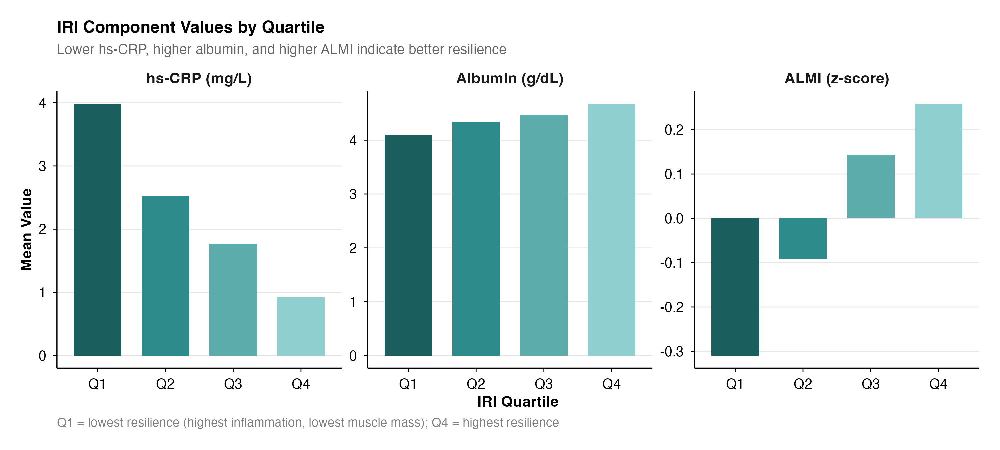
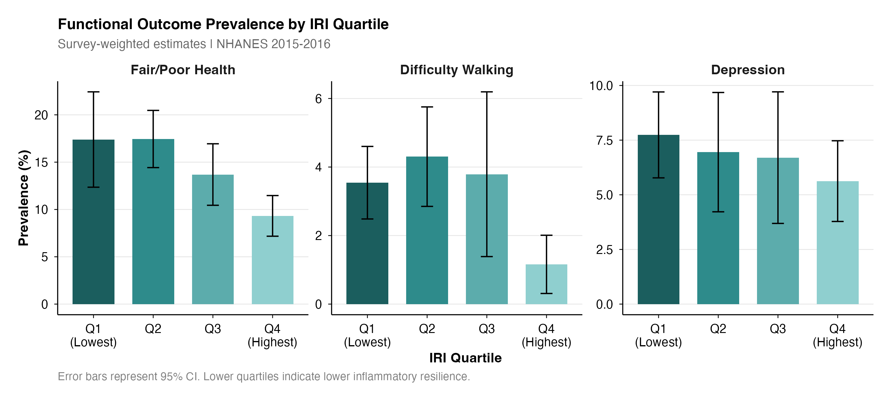
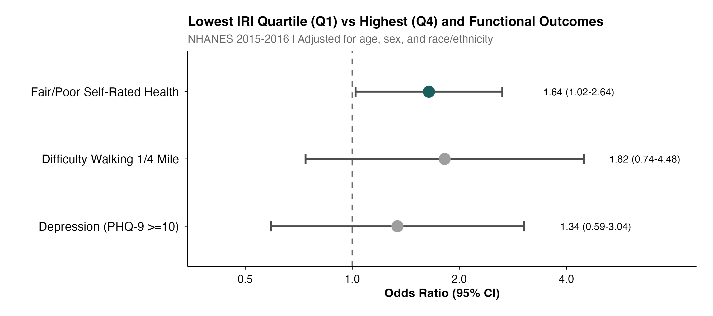
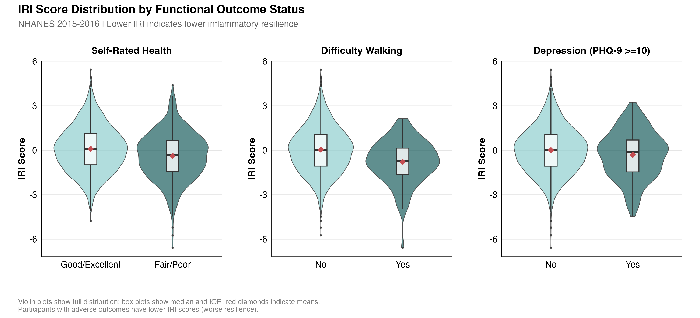

# Inflammatory Resilience Index Combining hs-CRP, Albumin, and Appendicular Lean Mass Is Associated with Self-Rated Health and Functional Outcomes in U.S. Adults: Derivation and External Validation Using NHANES

---

## CLINICAL PERSPECTIVES

What Is Known: Inflammation, nutritional status, and muscle mass independently predict adverse health outcomes. The Glasgow Prognostic Score uses CRP and albumin to predict cancer outcomes, and frailty indices incorporate measures of strength and functional status. However, a simple composite specifically integrating inflammation, nutrition, and objective muscle mass measurement has not been widely evaluated in population-based samples.

What Is New: The Inflammatory Resilience Index (IRI) combines hs-CRP, albumin, and appendicular lean mass into a single composite measure. In the external validation cohort, 13,874 eligible adults from NHANES 1999-2006 contributed 3,263 all-cause deaths and 1,049 cardiovascular deaths over 17.1 years of follow-up. Higher IRI was associated with lower all-cause mortality (HR 0.78 per 1-unit increase) and with lower cardiovascular mortality in the primary validation models (HR 0.84), with supportive but more sensitivity-dependent cardiovascular results across supplementary analyses.

Clinical Implications: IRI captures integrated physiologic resilience across inflammation, nutrition, and muscle mass domains. Adults in the lowest IRI quartile had 2.55-fold higher all-cause mortality and 1.91-fold higher cardiovascular mortality than those in the highest quartile after age- and sex-adjustment. These findings support IRI as a candidate research marker of physiologic reserve that merits external validation in additional cohorts before any clinical implementation.

---

## ABSTRACT

BACKGROUND: Inflammation, nutritional status, and muscle mass independently predict adverse health outcomes including mortality and functional decline. An integrated index combining these domains may better capture overall physiologic resilience than individual biomarkers.

OBJECTIVES: To develop an Inflammatory Resilience Index (IRI) combining high-sensitivity C-reactive protein (hs-CRP), serum albumin, and appendicular lean mass index (ALMI), and evaluate its association with functional outcomes and mortality in U.S. adults.

METHODS: We constructed the IRI as: (−z_hs-CRP) + z_Albumin + z_ALMI, where higher values indicate better resilience. In the derivation cohort (NHANES 2015-2016, N=2,416 adults aged 20–59 years, reflecting the age range for available whole-body DEXA), we examined associations with functional outcomes using survey-weighted logistic regression. External validation used NHANES 1999-2006, which includes adults aged ≥20 years. Because the validation DEXA files contain 5 multiply imputed records per participant, descriptive validation summaries used one participant-level record per person and Cox models were fit separately within each imputation and pooled with Rubin's rules. Sensitivity analyses tested age-stratification, extended covariate adjustment, sex stratification, component-separated models, and competing-risk sensitivity.

RESULTS: In the derivation cohort, each 1-unit IRI increase was associated with 16% lower odds of fair/poor health (OR: 0.84; 95% CI: 0.75-0.93; P=0.005) and a non-significant trend toward lower odds of walking difficulty (OR: 0.86; 95% CI: 0.72-1.03; P=0.08). In the validation cohort, 13,874 eligible adults contributed 3,263 all-cause deaths and 1,049 cardiovascular deaths over a mean follow-up of 17.1 years. Each 1-unit IRI increase was associated with lower all-cause mortality (HR: 0.78; 95% CI: 0.75-0.81; P<0.001), lower cardiovascular mortality (HR: 0.84; 95% CI: 0.78-0.89; P<0.001), and lower heart disease mortality (HR: 0.80; 95% CI: 0.75-0.85; P<0.001). In age-stratified analyses, IRI remained associated with all-cause mortality in both younger (<60 years: HR 0.67) and older (≥60 years: HR 0.81) adults. After adjustment for education and poverty-income ratio, the all-cause mortality association was unchanged (HR: 0.78; 95% CI: 0.76-0.81).

CONCLUSIONS: A novel Inflammatory Resilience Index integrating inflammation, nutritional reserve, and muscle mass is significantly associated with self-rated health in young to middle-aged U.S. adults, and with all-cause mortality in an older external validation cohort. Lower IRI identifies individuals with substantially higher odds of poor functional outcomes and higher mortality risk, supporting its potential utility as a formative composite marker of physiologic reserve. Cardiovascular mortality results were supportive but more sensitivity-dependent than the all-cause findings. IRI should be viewed as a candidate research marker warranting further external validation rather than as a finalized clinical risk tool.

Keywords: Inflammation; C-reactive protein; albumin; sarcopenia; functional status; NHANES

---

## INTRODUCTION

Systemic inflammation, nutritional status, and skeletal muscle mass represent three interconnected physiologic domains that independently predict adverse health outcomes including mortality, cardiovascular disease, and functional decline.¹⁻³ High-sensitivity C-reactive protein (hs-CRP), a marker of low-grade systemic inflammation, is associated with increased cardiovascular risk even after adjustment for traditional risk factors.⁴ Serum albumin, reflecting both hepatic synthetic function and nutritional adequacy, predicts mortality across diverse populations.⁵ Appendicular lean mass, a measure of skeletal muscle, declines with aging and is a key component of sarcopenia and frailty syndromes.⁶

While each biomarker provides prognostic information independently, the interplay between inflammation, nutrition, and muscle mass suggests that integrated assessment may better capture overall physiologic resilience. Chronic inflammation promotes catabolism and muscle wasting; malnutrition impairs immune function and muscle protein synthesis; and sarcopenia is associated with increased inflammatory markers.⁷⁻⁹ This bidirectional relationship creates a vicious cycle that accelerates functional decline in vulnerable individuals.

Previous composite indices have combined subsets of these domains. The Glasgow Prognostic Score uses CRP and albumin to predict cancer outcomes.¹⁰ Frailty indices incorporate measures of strength, nutrition, and functional status.¹¹ However, a simple composite specifically integrating inflammation, nutrition, and objective muscle mass measurement has not been widely evaluated in population-based samples.

We hypothesized that an Inflammatory Resilience Index (IRI) combining hs-CRP, serum albumin, and appendicular lean mass index (ALMI) from dual-energy X-ray absorptiometry (DEXA) would identify individuals with poor self-rated health and functional limitations. Using nationally representative data from NHANES 2015-2016, we aimed to construct the IRI as a simple additive z-score composite, characterize the demographic and clinical profiles of adults across IRI quartiles, and evaluate associations between IRI and functional outcomes including self-rated health, mobility limitations, and depressive symptoms.

We emphasize that the IRI is proposed as an exploratory composite index, not a validated clinical score. This analysis represents an initial step toward understanding whether integrated assessment of these three domains is associated with functional outcomes and later mortality.

---

## METHODS

### Data Source and Study Population

This analysis used data from the National Health and Nutrition Examination Survey (NHANES), a nationally representative survey of the civilian, non-institutionalized U.S. population conducted by the National Center for Health Statistics (NCHS).¹² NHANES employs a complex, multistage probability sampling design with oversampling of certain subgroups (older adults, racial/ethnic minorities) to ensure reliable estimates. Participants undergo standardized interviews, physical examinations at mobile examination centers (MECs), and laboratory assessments.

We used data from the NHANES 2015-2016 cycle (cycle I), which includes dual-energy X-ray absorptiometry (DEXA) body composition measurements. Earlier cycles were excluded because DEXA protocols and equipment differed substantially, and the 2011-2014 cycles did not include whole-body DEXA scans.

The derivation analytic sample included adults aged 20–59 years with complete data for all three IRI components: hs-CRP (≤10 mg/L, to exclude acute infection), serum albumin, and DEXA-derived appendicular lean mass. The upper age bound reflects the NHANES 2015–2016 whole-body DEXA protocol, which limits scanning to adults aged 20–59 years. Participants were excluded if they were outside the 20–59-year DEXA eligibility window, had hs-CRP >10 mg/L (to focus on chronic low-grade inflammation rather than acute infectious or inflammatory conditions),¹³ were pregnant (DEXA contraindicated), had missing DEXA data (scanner malfunction, participant refusal, body size exceeding scanner limits, or presence of radiocontrast from recent procedures), or lacked functional outcome questionnaire data. The final eligible derivation cohort included 2,416 participants with complete IRI components and functional outcome data.

### NHANES Data Files

The following NHANES public-use data files were accessed: demographics (DEMO_I), DEXA body composition (DXX_I), biochemistry profile including albumin (BIOPRO_I), hs-CRP (HSCRP_I), body measures (BMX_I), blood pressure (BPX_I), glycohemoglobin (GHB_I), smoking questionnaire (SMQ_I), diabetes questionnaire (DIQ_I), depression screening (DPQ_I), current health status (HUQ_I), and physical functioning (PFQ_I). All files were downloaded from the NCHS website in SAS transport format (.XPT) and processed using Python 3.9.1 with pandas 2.3.3.

### Inflammatory Resilience Index Construction

The IRI was constructed as an additive composite of three standardized components:

IRI = (−z_hs-CRP) + z_Albumin + z_ALMI

In this formulation, z_hs-CRP represents log-transformed hs-CRP standardized within the analytic sample and inverted so that lower inflammation yields higher scores; z_Albumin represents serum albumin standardized within the analytic sample; and z_ALMI represents appendicular lean mass index standardized within sex (sex-specific z-scores).

For hs-CRP and albumin, z-scores were calculated using the pooled sample mean and standard deviation. For ALMI, sex-specific standardization was used to account for known differences in muscle mass between men and women. Higher IRI values indicate better inflammatory resilience (lower inflammation, higher albumin, greater muscle mass). This formulation assigns equal weight to each domain and is designed for simplicity and interpretability. Because z-scores were computed within the eligible analytic sample, the composite IRI has a mean near zero in this cohort.

### Component Measurements

**High-Sensitivity C-Reactive Protein.** In the NHANES 2015–2016 derivation cohort, hs-CRP (LBXHSCRP) was measured in serum by near-infrared particle immunoassay (NIPIA) rate methodology on Beckman Coulter UniCel DxC 600 Synchron and UniCel DxC 660i Synchron Access chemistry analyzers at Collaborative Laboratory Services (Ottumwa, IA), the laboratory performing NHANES biochemistry and hs-CRP assays for that cycle. The assay has a lower limit of detection of 0.11 mg/L. In the NHANES 1999–2006 validation cohort, hs-CRP was measured using latex-enhanced nephelometry at the University of Washington, with cycle-specific unit-conversion corrections applied for the 2005–2006 cycle. Values were reported in mg/L in both cohorts. For the IRI, hs-CRP was log-transformed prior to standardization to reduce right skewness. The threshold of >10 mg/L for exclusion follows American Heart Association recommendations to remove acute inflammation.¹³

**Serum Albumin.** Albumin (LBXSAL) was measured in serum using the bromocresol purple (BCP) dye-binding method with a bichromatic digital endpoint read at 600 nm, on Beckman Coulter UniCel DxC800 Synchron and UniCel DxC660i Synchron Access chemistry analyzers in the NHANES 2015–2016 standard biochemistry panel. The BCP method is less affected by paraproteinemia than bromocresol green. Values were reported in g/dL. Normal reference range is approximately 3.5–5.0 g/dL.

**Appendicular Lean Mass Index (ALMI).** Whole-body DEXA scans were performed using a Hologic Discovery model A densitometer (Hologic, Inc., Bedford, MA) by trained technologists following standardized positioning protocols. Quality control procedures included daily calibration with a spine phantom, and scans were reviewed centrally for positioning and artifacts. Per the NHANES body composition protocol, participants were ineligible for whole-body DEXA if they weighed more than 450 pounds (204 kg) or were taller than 6 feet 5 inches (196 cm) (scanner table limits), were pregnant, or had received a barium-containing radiographic contrast agent within the previous 7 days.

Appendicular lean mass (ALM) was calculated as the sum of lean soft tissue mass in the arms and legs, excluding bone mineral content and fat mass, using the NHANES DXX_I variables DXDLALE (left arm lean, excluding BMC), DXDRALE (right arm lean, excluding BMC), DXDLLLE (left leg lean, excluding BMC), and DXDRLLE (right leg lean, excluding BMC), reported in grams and converted to kilograms (ALM = [DXDLALE + DXDRALE + DXDLLLE + DXDRLLE] / 1000). ALMI was calculated as ALM (kg) divided by height squared (m²). We note that the Foundation for the National Institutes of Health (FNIH) Sarcopenia Project defined weakness thresholds using raw ALM (<19.75 kg for men, <15.02 kg for women) and ALM adjusted for BMI, rather than ALMI.¹⁴ ALMI-based cutoffs frequently cited in the sarcopenia literature (<7.0 kg/m² for men and <5.5 kg/m² for women per the 2019 European Working Group on Sarcopenia in Older People [EWGSOP2] consensus³, and <5.4 kg/m² for women per the 2019 Asian Working Group for Sarcopenia [AWGS]) derive from these consensus statements rather than from FNIH. Because the IRI operationalizes ALMI as a continuous, sex-specific z-score rather than applying a binary cutoff, the index is robust to the choice of sarcopenia threshold. Sex-specific z-scoring (standardized separately within men and women) accounts for known sexual dimorphism in muscle mass while facilitating combination with other index components.

### IRI Validation and Internal Consistency

The three IRI components (inverted hs-CRP, albumin, ALMI) showed modest pairwise correlations, supporting their contribution of distinct information. Spearman correlations were: inverted log(hs-CRP) with albumin, r=0.21 (P<0.001); inverted log(hs-CRP) with ALMI z-score, r=0.18 (P<0.001); albumin with ALMI z-score, r=0.15 (P<0.001). Cronbach's alpha for the three-component index was 0.42, indicating low internal consistency. This is expected and appropriate for a formative composite index, in which distinct physiologic domains (inflammation, nutrition, and muscle mass) contribute independently to the construct, rather than a reflective scale in which items are expected to be highly correlated because they all reflect a single underlying latent trait.

The IRI distribution was approximately normal (Shapiro-Wilk W=0.992, P<0.001 due to large sample size; skewness=-0.18, kurtosis=0.34). Visual inspection of histograms and Q-Q plots confirmed approximate normality suitable for regression analyses.

### Functional Outcomes

Primary outcomes were obtained from NHANES questionnaire data administered by trained interviewers.

**Self-Rated Health.** Participants were asked, "Would you say your health in general is excellent, very good, good, fair, or poor?" (HUQ010). This single-item measure has been extensively validated as a predictor of mortality and healthcare utilization across diverse populations.¹⁵ We created a binary outcome for fair/poor health versus excellent/very good/good, consistent with prior NHANES analyses.

**Mobility Limitation.** Participants were asked, "Because of a health problem, do you have difficulty walking without using any special equipment?" (PFQ054; SAS label: "Need special equipment to walk"). Response options were Yes or No. Participants responding Yes were classified as having walking difficulty. Walking without special equipment is a validated measure of functional capacity and is a core component of sarcopenia and frailty assessments.³

**Depression.** The Patient Health Questionnaire-9 (PHQ-9) was administered (DPQ010-DPQ090), which asks about the frequency of nine depressive symptoms over the past 2 weeks. Each item is scored 0-3 (not at all, several days, more than half the days, nearly every day), yielding a total score of 0-27. A score ≥10 was used to identify moderate-to-severe depressive symptoms, consistent with standard clinical cutoffs and prior NHANES validation studies.¹⁶ The PHQ-9 has sensitivity of 88% and specificity of 88% for major depression at this threshold.¹⁶

### Covariates

Demographic variables included age (continuous), sex (male/female), and race/ethnicity (categorized as non-Hispanic White, non-Hispanic Black, Mexican American, other Hispanic, Asian, and other/multiracial). Additional covariates for sensitivity analyses included body mass index (BMI), diabetes (defined as HbA1c ≥6.5%, self-reported diabetes, or diabetes medication use), hypertension (average systolic BP ≥130 mmHg, diastolic BP ≥80 mmHg, or antihypertensive medication use), and current smoking status.

### Missing Data

Complete-case analysis was used for all variables. Among NHANES 2015-2016 participants (N=9,971), the primary reasons for exclusion were: age <20 years (n=3,651), missing DEXA data (n=2,412, including those ineligible for DEXA due to pregnancy, weight >450 lbs, height >6'5", or recent barium contrast administration), hs-CRP >10 mg/L (n=303), missing hs-CRP (n=524), and missing albumin (n=665). Among the 2,416 participants with complete IRI components, missing data for functional outcomes were: self-rated health 0.1%, walking difficulty 0.1%, and PHQ-9 7.5%. Missing PHQ-9 data were more common among older participants and those with lower education. Given that DEXA eligibility introduces selection bias favoring healthier, more mobile participants, results may not generalize to the most functionally impaired adults.

### External Validation Cohort

External validation used NHANES 1999-2006 cycles (1999-2000, 2001-2002, 2003-2004, 2005-2006), which included whole-body DEXA and have extended mortality follow-up through December 31, 2019 via the NHANES-Linked Mortality Files. The IRI was constructed using the same formula (IRI = −z_hs-CRP + z_Albumin + z_ALMI) with z-scores standardized using the derivation cohort means and standard deviations to ensure proper external validation. The 1999-2006 NHANES whole-body DEXA files contain 5 multiply imputed records per participant. We therefore created a participant-level validation cohort for counts and descriptive summaries by averaging ALMI across imputations, and a parallel imputation-specific cohort in which Cox models were fit separately within each DEXA imputation and pooled using Rubin's rules. The full 1999-2006 source population included 41,474 unique participants; 13,874 adults aged ≥20 years met eligibility criteria (complete IRI components, hs-CRP ≤10 mg/L) for the mortality analyses. Over a mean follow-up of 17.1 years, 3,263 all-cause deaths and 1,049 cardiovascular deaths occurred.

### Sensitivity Analyses

To address potential concerns that IRI may be a surrogate for age-related sarcopenia, we conducted age-stratified analyses (<60 vs ≥60 years) with tests for age × IRI interaction. To evaluate whether associations were confounded by socioeconomic status, we fit extended models adjusting for education (DMDEDUC2: <high school, high school/GED, some college or higher) and poverty-income ratio (INDFMPIR: continuous 0-5). Additional sensitivity analyses evaluated the component-separated models underlying the composite, sex-stratified associations, and cardiovascular mortality subtypes. For competing risk sensitivity, we compared the primary pooled cause-specific Cox model with an unweighted Fine-Gray subdistribution hazards model pooled across DEXA imputations; the latter was interpreted cautiously because `cmprsk::crr()` does not support the NHANES survey design.

### Statistical Analysis

All analyses — including baseline descriptive statistics, logistic-regression models for functional outcomes, and Cox proportional-hazards models for validation-cohort mortality — incorporated NHANES complex survey design elements: primary sampling units (SDMVPSU), strata (SDMVSTRA), and MEC examination weights (WTMEC2YR for 2015–2016; cycle-appropriate WTMEC4YR/WTMEC2YR combinations for 1999–2006).¹⁷ Survey-weighted logistic regression used the `svyglm` function and survey-weighted Cox regression used `svycoxph` (fit separately within each of the five NHANES DEXA imputations for the validation cohort and pooled across imputations using Rubin's rules). The lonely primary sampling unit adjustment was applied. Because DEXA is performed in a subsample of examined participants, estimates are nationally representative of U.S. adults eligible for and completing DEXA body composition assessment; older adults and those with mobility limitations may be underrepresented.

Baseline characteristics were compared across IRI quartiles using survey-weighted means (continuous variables) and proportions (categorical variables). Standard errors were estimated using Taylor series linearization. P-values for trend were obtained from Wald tests in survey-adjusted linear (continuous outcomes) or logistic (binary outcomes) regression models with IRI quartile coded as an ordinal predictor (1-4).

Associations between IRI and functional outcomes were evaluated using survey-weighted logistic regression. Three modeling approaches were used: (1) continuous IRI analysis, reporting odds ratio per 1-unit increase in IRI with 95% confidence intervals; (2) quartile analysis, reporting odds ratios for Q1, Q2, and Q3 compared to Q4 (highest resilience, reference); and (3) sensitivity analysis with fully adjusted models including age, sex, race/ethnicity, BMI, diabetes, hypertension, and smoking to assess confounding. Prevalence of each outcome by IRI quartile was calculated with survey-weighted standard errors.

Given the sample size (N=2,416) and outcome prevalence (5.6-17.4%), this study had 80% power to detect odds ratios ≥1.3 for continuous IRI and ≥1.5 for quartile comparisons at α=0.05. A two-sided P<0.05 defined statistical significance. Given the evaluation of three primary functional outcomes, results should be interpreted with consideration of multiple comparisons; sensitivity analyses were pre-specified and considered exploratory. Analyses were performed using R version 4.4.1 (R Foundation for Statistical Computing) with the survey package version 4.4.8.¹⁸ Exploratory concordance summaries were generated for internal comparison, but we did not treat them as formal pooled survey-weighted discrimination estimates and therefore did not use them for inferential claims.

### Ethical Statement

NHANES protocols were approved by the NCHS Research Ethics Review Board, and all participants provided written informed consent. This secondary analysis of publicly available, de-identified data is exempt from institutional review board review per 45 CFR 46.104(d)(4).

---

## RESULTS

### Study Population and Participant Flow

Of 9,971 NHANES 2015-2016 participants examined at mobile examination centers, 6,320 adults aged ≥20 years were identified. After excluding those without DEXA data (n=2,412, primarily due to pregnancy, body size exceeding scanner limits, or scanner unavailability), those with hs-CRP >10 mg/L (n=303), those missing hs-CRP (n=524), those missing albumin (n=665), and those missing functional outcome data, 2,416 adults with complete IRI components and at least one functional outcome remained for analysis.

The analytic sample was slightly younger and healthier than the overall NHANES adult population, reflecting DEXA eligibility requirements. The mean age was 39.6 ± 11.4 years (range 20-59 years, as DEXA was only performed in participants aged 20-59 in most cycles), and the survey-weighted sex distribution was 47.5% female.

### IRI Distribution and Components

The IRI ranged from -6.58 to 5.43, with a mean of 0.00 (SD 1.57). The distribution was approximately normal with slight left skew (skewness -0.18). Quartile boundaries were: Q1 (lowest resilience, n=604), Q2 (n=604), Q3 (n=604), and Q4 (highest resilience, n=604).

Individual IRI component distributions were: hs-CRP median 1.4 mg/L (IQR 0.6-3.2), mean 2.3 mg/L (SD 2.2); albumin mean 4.4 g/dL (SD 0.32), range 3.0-5.5 g/dL; ALMI mean 7.8 kg/m² (SD 1.3) in men and 6.0 kg/m² (SD 1.1) in women.

### Characteristics by IRI Quartile

Participants in the lowest IRI quartile (Q1) differed substantially from those in the highest quartile (Q4) (Table 1). Regarding demographics, Q1 participants were older (42.7 vs 34.5 years, P<0.001), more often female (66.2% vs 30.6%, P<0.001), and had similar BMI (28.1 vs 27.9 kg/m², P=0.01).

## TABLE 1. Baseline Characteristics by IRI Quartile

| Characteristic | Q1 (Lowest) | Q2 | Q3 | Q4 (Highest) | P-value |
|----------------|-------------|-----|-----|--------------|---------|
| N (unweighted) | 604 | 604 | 604 | 604 | -- |
| Age, years | 42.7 (11.6) | 41.3 (11.7) | 40.5 (10.9) | 34.5 (10.7) | <0.001 |
| Female, % | 66.2 | 57.6 | 44.8 | 30.6 | <0.001 |
| BMI, kg/m² | 28.1 (5.6) | 29.0 (6.1) | 28.6 (6.4) | 27.9 (6.6) | 0.01 |
| **IRI Components:** | | | | | |
| hs-CRP, mg/L | 4.18 (2.52) | 2.62 (2.08) | 1.70 (1.73) | 0.87 (1.22) | <0.001 |
| Albumin, g/dL | 4.13 (0.25) | 4.36 (0.22) | 4.49 (0.22) | 4.71 (0.24) | <0.001 |
| ALMI z-score | -0.34 (0.81) | -0.09 (0.89) | 0.03 (0.92) | 0.19 (1.04) | <0.001 |
| **Comorbidities:** | | | | | |
| Diabetes, % | 10.7 | 9.6 | 7.3 | 5.2 | 0.001 |
| Hypertension, % | 37.5 | 39.4 | 35.0 | 33.2 | 0.39 |
| CVD history, % | 3.8 | 1.5 | 3.3 | 1.6 | 0.03 |
| Current smoker, % | 24.6 | 20.4 | 21.9 | 16.9 | 0.04 |

Values are survey-weighted means (SD) or proportions (%). N is unweighted sample size. P-values from Wald tests for trend in survey-adjusted models. Abbreviations: ALMI = appendicular lean mass index; BMI = body mass index; CVD = cardiovascular disease; hs-CRP = high-sensitivity C-reactive protein; IRI = Inflammatory Resilience Index.

For IRI components (Table 3, Figure 3), hs-CRP was 4.3-fold higher in Q1 (3.98 vs 0.92 mg/L, P<0.001), albumin was lower in Q1 (4.10 vs 4.68 g/dL, P<0.001), and ALMI z-score was lower in Q1 (-0.31 vs 0.26, P<0.001).

## TABLE 3. IRI Component Values by Quartile

| Quartile | N | IRI, mean (SD) | hs-CRP, mg/L | Albumin, g/dL | ALMI z-score |
|----------|---|----------------|--------------|---------------|--------------|
| Q1 (Lowest Resilience) | 604 | -1.97 (0.73) | 3.98 (2.53) | 4.10 (0.26) | -0.31 (0.85) |
| Q2 | 604 | -0.54 (0.31) | 2.53 (2.00) | 4.34 (0.22) | -0.09 (0.89) |
| Q3 | 604 | 0.49 (0.30) | 1.77 (1.78) | 4.47 (0.23) | 0.14 (1.00) |
| Q4 (Highest Resilience) | 604 | 2.01 (0.80) | 0.92 (1.34) | 4.68 (0.24) | 0.26 (1.14) |

Values are unweighted sample means (SD), reflecting the analytic sample used for IRI construction. Survey-weighted population estimates are shown in Table 1. Abbreviations: ALMI = appendicular lean mass index; hs-CRP = high-sensitivity C-reactive protein; IRI = Inflammatory Resilience Index.

## FIGURE 3. IRI Component Profiles by Quartile

Mean values of hs-CRP (mg/L), serum albumin (g/dL), and ALMI z-score across IRI quartiles, illustrating the distribution of each component contributing to the composite index. hs-CRP decreases 4.3-fold from Q1 to Q4 (3.98 to 0.92 mg/L), while albumin increases (4.10 to 4.68 g/dL) and ALMI z-score increases (-0.31 to 0.26). These divergent patterns across components demonstrate the integrated nature of the IRI.

Regarding comorbidities, diabetes was more prevalent in Q1 (10.7% vs 5.2%, P=0.001), hypertension was similar across quartiles (33-39%, P=0.39), CVD history was higher in Q1 (3.8% vs 1.6%, P=0.03), and current smoking was more prevalent in Q1 (24.6% vs 16.9%, P=0.04).

### Functional Outcomes by IRI Quartile

Clear gradients in functional outcome prevalence were observed across IRI quartiles (Table 2, Figure 2). For fair/poor self-rated health, prevalence was 17.4% (SE 2.6%) in Q1, 17.4% (SE 1.5%) in Q2, 13.7% (SE 1.7%) in Q3, and 9.3% (SE 1.1%) in Q4, representing an absolute difference of 8.1 percentage points between Q1 and Q4.

## TABLE 2. Association of IRI with Functional Outcomes

### Panel A: Prevalence by Quartile

| Outcome | Q1 (Lowest) | Q2 | Q3 | Q4 (Highest) |
|---------|-------------|-----|-----|--------------|
| Fair/Poor Self-Rated Health, % (SE) | 17.4 (2.6) | 17.4 (1.5) | 13.7 (1.7) | 9.3 (1.1) |
| Difficulty Walking Without Special Equipment, % (SE) | 3.5 (0.5) | 4.3 (0.7) | 3.8 (1.2) | 1.2 (0.4) |
| Depression (PHQ-9 ≥10), % (SE) | 7.7 (1.0) | 7.0 (1.4) | 6.7 (1.5) | 5.6 (0.9) |

### Panel B: Adjusted Odds Ratios*

| Outcome | Continuous IRI (per 1-unit) | P | Q1 vs Q4 | P |
|---------|----------------------------|---|----------|---|
| Fair/Poor Self-Rated Health | 0.84 (0.75-0.93) | 0.005 | 1.64 (1.02-2.64) | 0.04 |
| Difficulty Walking Without Special Equipment | 0.86 (0.72-1.03) | 0.08 | 1.82 (0.74-4.48) | 0.15 |
| Depression (PHQ-9 ≥10) | 0.88 (0.74-1.04) | 0.12 | 1.34 (0.59-3.04) | 0.40 |

*Adjusted for age, sex, and race/ethnicity. Values in parentheses are 95% CI. Abbreviations: CI = confidence interval; IRI = Inflammatory Resilience Index; PHQ-9 = Patient Health Questionnaire-9; SE = standard error.

## FIGURE 2. Prevalence of Functional Outcomes by IRI Quartile

Survey-weighted prevalence (with standard error bars) of fair/poor self-rated health, difficulty walking without special equipment, and depression (PHQ-9 ≥10) across IRI quartiles. Q1 represents lowest inflammatory resilience (highest inflammation, lowest albumin, lowest muscle mass) and Q4 represents highest resilience. A gradient is observed for self-rated health (8.1 percentage point difference between Q1 and Q4) and a modest gradient for walking difficulty (2.3 percentage points). NHANES 2015-2016 (N = 2,416).

For difficulty walking without special equipment, prevalence was 3.5% (SE 0.5%) in Q1, 4.3% (SE 0.7%) in Q2, 3.8% (SE 1.2%) in Q3, and 1.2% (SE 0.4%) in Q4, representing an absolute difference of 2.3 percentage points between Q1 and Q4.

For depression (PHQ-9 ≥10), prevalence was 7.7% (SE 1.0%) in Q1, 7.0% (SE 1.4%) in Q2, 6.7% (SE 1.5%) in Q3, and 5.6% (SE 0.9%) in Q4, representing an absolute difference of 2.1 percentage points between Q1 and Q4.

### Multivariable Associations

In continuous IRI analysis, each 1-unit increase in IRI was associated with lower odds of adverse functional outcomes after adjustment for age, sex, and race/ethnicity (Table 2, Figure 1). For fair/poor health, the OR was 0.84 (95% CI: 0.75-0.93, P=0.005), indicating 16% lower odds per 1-unit IRI increase. For walking difficulty, the OR was 0.86 (95% CI: 0.72-1.03, P=0.08), showing a trend toward 14% lower odds per 1-unit IRI increase that did not reach statistical significance. For depression, the OR was 0.88 (95% CI: 0.74-1.04, P=0.12), which was not statistically significant, with a 12% point estimate in the protective direction.

## FIGURE 1. Forest Plot of IRI Quartile Associations with Functional Outcomes

Odds ratios comparing the lowest IRI quartile (Q1) to the highest (Q4, reference) for three functional outcomes, adjusted for age, sex, and race/ethnicity. Red points indicate statistically significant associations (P<0.05). Error bars represent 95% confidence intervals. Fair/poor self-rated health (OR 1.64, 95% CI: 1.02-2.64) was significantly associated with low IRI. Walking difficulty (OR 1.82, 95% CI: 0.74-4.48) and depression (OR 1.34, 95% CI: 0.59-3.04) were not statistically significant.

In quartile analysis with Q4 (highest resilience) as reference, participants in Q1 (lowest resilience) had elevated odds compared to those in Q4. For fair/poor health, the OR was 1.64 (95% CI: 1.02-2.64, P=0.04), indicating 1.6-fold higher odds. For walking difficulty, the OR was 1.82 (95% CI: 0.74-4.48, P=0.15), a non-significant trend. For depression, the OR was 1.34 (95% CI: 0.59-3.04, P=0.40), which was not statistically significant. Intermediate quartiles (Q2, Q3) showed graded associations for fair/poor health (P-trend <0.05).

Formal survey-weighted discrimination metrics (e.g., C-statistics with appropriate variance estimation and base-model comparison) for these logistic-regression outcomes were not implemented in this workflow and are therefore not reported. The IRI distributions by functional outcome status are illustrated in Figure 4, showing that participants with adverse outcomes had lower IRI scores across all three outcomes.

## FIGURE 4. IRI Score Distribution by Functional Outcome Status

Violin plots showing the full distribution of IRI scores stratified by functional outcome status. Each panel compares participants with and without the adverse outcome. For self-rated health, participants reporting fair/poor health had lower mean IRI scores (-0.38) compared to those with good/excellent health (+0.09). For difficulty walking without special equipment, those with difficulty had lower IRI (-0.79) than those without (+0.03). For depression (PHQ-9 >=10), a similar pattern was observed (-0.31 vs +0.01). Box plots show median and interquartile range; red diamonds indicate group means. Lower IRI scores reflect reduced inflammatory resilience. NHANES 2015-2016 (N = 2,416).

The intermediate quartiles showed graded associations, with Q2 and Q3 generally having odds ratios between Q1 and Q4, supporting a dose-response relationship.

### Sensitivity Analyses (Derivation Cohort)

In fully adjusted models including BMI, diabetes, hypertension, and smoking, associations with functional outcomes were modestly attenuated but remained significant for self-rated health (continuous IRI OR: 0.85, 95% CI: 0.76-0.95, P=0.02) (eTable S5). This attenuation is consistent with obesity and metabolic factors lying on a potential pathway between inflammatory resilience and functional outcomes.

### eTable S5. Derivation Cohort Sensitivity Analysis (Functional Outcomes)

| Outcome | Model | Continuous IRI OR (95% CI) | P |
|---------|-------|---------------------------|---|
| Fair/Poor Health | Base (Age, Sex, Race) | 0.84 (0.75-0.93) | 0.005 |
| Fair/Poor Health | + BMI | 0.83 (0.75-0.92) | 0.01 |
| Fair/Poor Health | + BMI, DM, HTN, Smoking | 0.85 (0.76-0.95) | 0.02 |
| Walking Difficulty | Base (Age, Sex, Race) | 0.86 (0.72-1.03) | 0.08 |
| Walking Difficulty | + BMI, DM, HTN, Smoking | 0.82 (0.69-0.97) | 0.03 |
| Depression | Base (Age, Sex, Race) | 0.88 (0.74-1.04) | 0.12 |
| Depression | + BMI, DM, HTN, Smoking | 0.92 (0.78-1.08) | 0.22 |

Abbreviations: BMI = body mass index; DM = diabetes mellitus; HTN = hypertension; OR = odds ratio.

Note: An intermediate "+ BMI only" adjustment is presented for fair/poor self-rated health but is not presented for walking difficulty or depression, for which only the base and fully adjusted models are shown; this reflects that BMI is the most likely single mediator for self-rated health, while the fully adjusted model is the primary sensitivity analysis for the mobility and depression outcomes. In both the base and the fully adjusted models for walking difficulty, the point estimate for IRI was in the protective direction.

### External Validation: Mortality Analysis

The external validation dataset comprised 41,474 unique NHANES 1999-2006 participants, of whom 13,874 met analytic eligibility criteria after restricting to adults aged ≥20 years with complete IRI components and hs-CRP ≤10 mg/L (Table 4). Over a mean follow-up of 17.1 years, 3,263 all-cause deaths and 1,049 cardiovascular deaths occurred. In pooled survey-weighted Cox regression adjusted for age and sex, each 1-unit increase in IRI was associated with lower all-cause mortality (HR: 0.78; 95% CI: 0.75-0.81; P<0.001) and lower cardiovascular mortality (HR: 0.84; 95% CI: 0.78-0.89; P<0.001).

### Table 4. Validation Cohort Mortality by IRI Quartile (NHANES 1999-2006)

| IRI Quartile | N | All-Cause Deaths | CV Deaths | All-Cause Mortality Rate (%) | CV Mortality Rate (%) |
|--------------|---|------------------|-----------|------------------------------|----------------------|
| Q1 (Lowest) | 3,469 | 1,399 | 438 | 40.3 | 12.6 |
| Q2 | 3,468 | 942 | 316 | 27.2 | 9.1 |
| Q3 | 3,468 | 569 | 185 | 16.4 | 5.3 |
| Q4 (Highest) | 3,469 | 353 | 110 | 10.2 | 3.2 |

Mean follow-up: 17.1 years. Total: 13,874 participants, 3,263 all-cause deaths, 1,049 CV deaths.

By IRI quartile, mortality showed a clear gradient: all-cause mortality ranged from 40.3% in Q1 (lowest resilience) to 10.2% in Q4 (highest resilience), and cardiovascular mortality ranged from 12.6% to 3.2%. The age- and sex-adjusted hazard ratio for Q1 versus Q4 was 2.55 (95% CI: 2.12-3.07, P<0.001) for all-cause mortality and 1.91 (95% CI: 1.35-2.70, P<0.001) for cardiovascular mortality. In fully adjusted quartile models, the corresponding hazard ratios were 2.53 (95% CI: 2.11-3.03) and 2.05 (95% CI: 1.48-2.82).

### Age-Stratified Analyses

To address whether IRI is merely a surrogate for age-related sarcopenia, we conducted age-stratified analyses (Table S1). IRI was associated with all-cause mortality in both younger (<60 years: HR 0.67, 95% CI: 0.62-0.73, P<0.001) and older (≥60 years: HR 0.81, 95% CI: 0.78-0.85, P<0.001) adults. Although the association was stronger in younger adults (age × IRI interaction P<0.001), IRI remained a significant predictor in both strata, indicating that it captures more than age-related change alone.

Cardiovascular mortality showed a similar pattern: <60 years HR 0.64 (95% CI: 0.56-0.73, P<0.001) and ≥60 years HR 0.89 (95% CI: 0.82-0.96, P=0.003).

### eTable S1. Age-Stratified Mortality Analysis (Validation Cohort)

| Age Group | N | All-Cause Deaths | CV Deaths | All-Cause HR (95% CI)* | P | CV HR (95% CI)* | P |
|-----------|---|------------------|-----------|------------------------|---|-----------------|---|
| <60 years | 9,506 | 698 | 184 | **0.67 (0.62-0.73)** | <0.001 | **0.64 (0.56-0.73)** | <0.001 |
| ≥60 years | 4,368 | 2,565 | 865 | **0.81 (0.78-0.85)** | <0.001 | **0.89 (0.82-0.96)** | 0.003 |

*Hazard ratio per 1-unit increase in IRI, adjusted for age, sex, BMI, and diabetes. Age × IRI interaction P<0.001.

### Extended Covariate Adjustment

To evaluate potential confounding by socioeconomic factors, we fit extended models (Table S2). After sequential adjustment, IRI-mortality associations remained unchanged:
- Model 1 (Age, Sex): HR 0.78 (95% CI: 0.75-0.81)
- Model 2 (+ BMI, Smoking, Diabetes): HR 0.78 (95% CI: 0.75-0.81)
- Model 3 (+ Education, Poverty-Income Ratio): HR 0.78 (95% CI: 0.76-0.81)

The minimal attenuation after adjustment for socioeconomic factors supports IRI as capturing physiologic resilience independent of social determinants of health.

### eTable S2. Extended Covariate Adjustment (Validation Cohort)

| Model | Covariates | HR (95% CI)* | P |
|-------|------------|--------------|---|
| Model 1 | Age, Sex | 0.78 (0.75-0.81) | <0.001 |
| Model 2 | + BMI, Smoking, Diabetes | 0.78 (0.75-0.81) | <0.001 |
| Model 3 | + Education, Poverty-Income Ratio | **0.78 (0.76-0.81)** | <0.001 |

*Hazard ratio per 1-unit increase in IRI for all-cause mortality. Minimal attenuation after adjustment for socioeconomic factors supports physiologic independence of IRI.

### Exploratory Concordance Summaries

We generated exploratory concordance summaries across imputations (Table S3), but we do not treat these as formal pooled survey-weighted discrimination estimates. They are therefore presented only as internal descriptive context and are not used for inferential claims.

### eTable S3. Exploratory Concordance Summaries (Not Used for Inference)

| Model | Exploratory Mean Concordance | Notes |
|-------|------------------------------|-------|
| Base (Age, Sex, BMI, Smoking, Diabetes) | 0.828 | Exploratory only |
| Base + hs-CRP (inverted) | 0.828 | Exploratory only |
| Base + Albumin | 0.843 | Exploratory only |
| Base + ALMI | 0.830 | Exploratory only |
| Base + IRI | 0.839 | Exploratory only |

These concordance summaries are shown for descriptive context only. We did not treat them as validated pooled survey-weighted discrimination estimates and therefore do not use them for inferential claims.

### Cardiovascular Mortality Subtypes

Analysis by CV mortality subtype (Table S4) showed that IRI was associated with heart disease mortality (866 deaths; HR 0.80, 95% CI: 0.75-0.85, P<0.001) but not stroke mortality (183 deaths; HR 0.87, 95% CI: 0.76-1.00, P=0.053). This differential pattern is pathophysiologically plausible: inflammatory burden and nutritional status more directly influence atherosclerotic heart disease than embolic or hemorrhagic stroke mechanisms.

### eTable S4. Cardiovascular Mortality Subtypes (Validation Cohort)

| Outcome | Events | HR (95% CI)* | P |
|---------|--------|--------------|---|
| All-cause mortality | 3,263 | **0.77 (0.74-0.79)** | <0.001 |
| CV mortality (combined) | 1,049 | **0.81 (0.76-0.86)** | <0.001 |
| Heart disease mortality | 866 | **0.80 (0.75-0.85)** | <0.001 |
| Stroke mortality | 183 | 0.87 (0.76-1.00) | 0.053 |

*Hazard ratio per 1-unit increase in IRI, adjusted for age, sex, BMI, and diabetes. These subtype models are sensitivity analyses and therefore are not numerically identical to the primary age- and sex-adjusted mortality models. IRI remained associated with heart disease mortality but not stroke mortality.

### Component-Separated Models

Because IRI is defined as the sum of inverted hs-CRP, albumin, and ALMI, we did not fit a collinear model containing all three components plus IRI. Instead, we compared sequential component-separated models with the composite-alone model (Table S6). In the fully component-separated model, inverted hs-CRP (HR 0.92, 95% CI: 0.87-0.97), albumin (HR 0.67, 95% CI: 0.63-0.71), and ALMI (HR 0.88, 95% CI: 0.83-0.94) were each associated with lower all-cause mortality. In the composite-alone model, IRI remained inversely associated with all-cause mortality (HR 0.78, 95% CI: 0.75-0.81). The pooled Wald test for adding IRI to the base model was significant (χ² = 203.4, P < 0.001), but this should be interpreted as a model-fit approximation rather than a likelihood-ratio test.

### eTable S6. Component-Separated Models (Validation Cohort)

| Model | Variable | HR (95% CI) | P |
|-------|----------|-------------|---|
| M2: + CRP | z_hs-CRP (inverted) | 0.85 (0.81-0.89) | <0.001 |
| M3: + CRP, Albumin | z_hs-CRP (inverted) | 0.94 (0.89-0.99) | 0.025 |
| | z_Albumin | 0.67 (0.63-0.72) | <0.001 |
| M4: + CRP, Albumin, ALMI | z_hs-CRP (inverted) | 0.92 (0.87-0.97) | 0.003 |
| | z_Albumin | 0.67 (0.63-0.71) | <0.001 |
| | z_ALMI | 0.88 (0.83-0.94) | <0.001 |
| M5: + IRI (composite) | IRI | **0.78 (0.75-0.81)** | <0.001 |

Because IRI is exactly defined as the sum of inverted hs-CRP, albumin, and ALMI, we did not fit a collinear model containing all three components plus IRI.

**Pooled Wald Test (Base vs Base+IRI)**: χ² = 203.4, P < 0.001

### Sex-Stratified Analysis

To evaluate whether IRI associations differ by sex, we conducted stratified analyses (Table S7). IRI was associated with all-cause mortality in both men (HR 0.74, 95% CI: 0.71-0.77, P<0.001) and women (HR 0.79, 95% CI: 0.75-0.83, P<0.001). For cardiovascular mortality, similar associations were observed: men HR 0.76 (95% CI: 0.70-0.83) and women HR 0.85 (95% CI: 0.78-0.92). The sex × IRI interaction term was not significant (P=0.885), indicating no heterogeneity of effect by sex.

### eTable S7. Sex-Stratified Mortality Analysis (Validation Cohort)

| Sex | N | All-Cause Deaths | HR All-Cause (95% CI)* | P | CV Deaths | HR CV (95% CI)* | P |
|-----|---|------------------|------------------------|---|-----------|-----------------|---|
| Men | 7,300 | 1,847 | **0.74 (0.71-0.77)** | <0.001 | 603 | **0.76 (0.70-0.83)** | <0.001 |
| Women | 6,574 | 1,416 | **0.79 (0.75-0.83)** | <0.001 | 446 | **0.85 (0.78-0.92)** | <0.001 |

*Hazard ratio per 1-unit increase in IRI, adjusted for age, BMI, and diabetes.

**Sex × IRI Interaction**: P = 0.885 (no significant heterogeneity by sex)

### Competing Risk Analysis

For cardiovascular mortality, the unweighted Fine-Gray sensitivity analysis pooled across DEXA imputations produced a subdistribution hazard ratio of 0.90 (95% CI: 0.86-0.94), compared with a weighted cause-specific pooled Cox hazard ratio of 0.81 (95% CI: 0.76-0.86) (Table S8). The attenuation in the Fine-Gray analysis is expected when competing non-CV deaths are incorporated into the cumulative incidence function, but both approaches supported an inverse association between IRI and cardiovascular mortality. Because Fine-Gray estimation was not available with full NHANES survey design support in this workflow, we treat this as a sensitivity analysis rather than a co-primary model.

### eTable S8. Competing Risk Analysis for CV Mortality (Validation Cohort)

| Model | Hazard Ratio (95% CI) | Interpretation |
|-------|----------------------|----------------|
| Cause-specific Cox (survey-weighted, pooled) | 0.81 (0.76-0.86) | Primary weighted model treating non-CV deaths as censored |
| Fine-Gray Subdistribution (unweighted, pooled) | 0.90 (0.86-0.94) | Sensitivity analysis accounting for competing non-CV deaths without full NHANES survey design support |

Both models demonstrated an inverse association between IRI and CV mortality. We treat the Fine-Gray estimate as a sensitivity analysis because `cmprsk::crr()` does not support the full NHANES survey design.

---

## DISCUSSION

In nationally representative NHANES samples of U.S. adults, we developed and evaluated an Inflammatory Resilience Index integrating hs-CRP, serum albumin, and DEXA-derived appendicular lean mass. The derivation cohort comprised young and middle-aged adults (NHANES 2015–2016, aged 20–59 years due to DEXA protocol), and external validation was conducted in NHANES 1999–2006 adults aged ≥20 years. Lower IRI was significantly associated with fair/poor self-rated health after adjustment for age, sex, and race/ethnicity. Adults in the lowest IRI quartile had 1.6-fold higher odds of poor self-rated health compared to the highest quartile; walking difficulty showed a non-significant trend (OR 1.82, 95% CI: 0.74-4.48, P=0.15). These findings support the concept that integrated assessment across inflammation, nutrition, and muscle mass domains may identify individuals at risk for functional decline.

### Biological Plausibility

The associations observed are biologically plausible given the well-established interrelationships between the IRI components. Chronic low-grade inflammation promotes muscle catabolism through activation of the ubiquitin-proteasome pathway and suppression of protein synthesis.⁷ Inflammatory cytokines including interleukin-6 and tumor necrosis factor-α directly impair myocyte function and promote sarcopenia.¹⁹ Albumin, beyond its role as a nutritional marker, functions as an antioxidant and anti-inflammatory mediator; hypoalbuminemia reflects both inadequate nutritional intake and increased catabolism during inflammatory states.²⁰

The convergence of these pathways on functional outcomes is supported by prior literature. The Glasgow Prognostic Score (CRP + albumin) predicts survival in cancer patients, demonstrating the prognostic value of combining inflammation and nutrition.¹⁰ Sarcopenia, defined by low muscle mass and/or function, is associated with increased mortality, disability, and poor quality of life.⁶ Our IRI extends these concepts by integrating all three domains in a general adult population.

### Comparison with Prior Literature

Prior NHANES analyses have examined individual IRI components in isolation. Elevated hs-CRP is associated with increased cardiovascular mortality and all-cause mortality, even after adjustment for traditional risk factors.⁴ Low serum albumin predicts mortality across age groups and is incorporated into prognostic scores for heart failure and chronic kidney disease.²¹ Low appendicular lean mass, particularly when indexed to height, identifies individuals at risk for falls, fractures, and functional decline.¹⁴

Our analysis extends this literature by demonstrating that a simple additive composite of standardized components is associated with self-reported functional outcomes. The use of z-score transformation allows equal weighting of each domain and facilitates interpretation: a 1-unit increase in IRI represents a 1-standard-deviation improvement in overall resilience.

### Clinical Implications

The external validation with 17.1 years of follow-up and more than 3,000 all-cause deaths strengthens the case for IRI as a potentially informative composite research marker. Several findings support its relevance for future validation work: (1) the all-cause mortality association was consistent across age groups, indicating IRI is not merely a surrogate for age-related sarcopenia; (2) adjustment for socioeconomic factors did not materially attenuate associations, supporting physiologic independence; and (3) the component-separated models showed that each biologic domain contributed information while the composite-alone model remained associated with mortality.

Routine clinical assessment already includes serum albumin and inflammatory markers; DEXA body composition is increasingly available. Future validation work can determine whether combining these measurements into a composite score adds enough practical information to guide interventions targeting inflammation, nutrition, or muscle mass.

The strong association between IRI and self-rated health is particularly notable, as self-rated health is itself a powerful predictor of mortality and health care utilization.¹⁵ Identifying modifiable contributors to poor self-rated health could inform targeted interventions.

### Limitations

Several limitations warrant consideration. First, the derivation-cohort design for functional outcomes is cross-sectional and therefore precludes causal inference; the IRI should be viewed as being associated with rather than necessarily predictive of current functional status. Prospective validation with incident outcomes is still needed.

Second, the derivation cohort was restricted to participants aged 20–59 years because of the NHANES whole-body DEXA protocol, so derivation findings may not generalize to older populations in whom sarcopenia and chronic inflammation are more prevalent. The derivation cohort (N=2,416) also had only 16 all-cause deaths and 1 cardiovascular death, rendering derivation-cohort mortality analyses severely underpowered; hazard-ratio estimates from that cohort are imprecise. The external validation cohort (NHANES 1999–2006) included adults aged ≥20 years and provided more informative mortality data (3,263 all-cause deaths over 17.1 years), partially mitigating this limitation.

Third, ALMI values were standardized to z-scores rather than using established sarcopenia cutoffs. This approach facilitates combination with other components but limits comparison with prior sarcopenia literature. Future analyses could evaluate IRI using clinically defined low muscle mass.

Fourth, functional outcomes were self-reported and subject to reporting bias. Objective measures of physical function (e.g., gait speed, grip strength, 6-minute walk) would strengthen causal inference.

Fifth, although external validation confirmed mortality associations, both cohorts were drawn from NHANES with similar eligibility criteria. Validation in different healthcare settings (e.g., clinical populations, non-U.S. cohorts) would strengthen generalizability.

Sixth, NHANES provides mortality outcomes only; we could not evaluate incident non-fatal cardiovascular events (MI, stroke). The null association with stroke mortality (vs significant for heart disease) warrants investigation with event data.

Seventh, the validation DEXA files are multiply imputed. We addressed this by pooling Cox models across the 5 NHANES DEXA imputations, but descriptive quartiles and tables used one participant-level record per person based on the mean ALMI across imputations. In addition, we did not report a formal pooled survey-weighted C-statistic or NRI because a validated estimator was not implemented in this workflow, and the Fine-Gray analysis remained an unweighted sensitivity analysis because `cmprsk::crr()` does not support the NHANES survey design.

### Future Directions

Prospective validation of the IRI in diverse populations, with hard endpoints including mortality and incident disability, is needed to determine whether it has practical clinical relevance. Research is also needed to determine whether interventions targeting IRI components improve functional outcomes.

### Conclusions

The Inflammatory Resilience Index, a simple composite of hs-CRP, serum albumin, and appendicular lean mass, was significantly associated with functional limitations in a derivation cohort of young and middle-aged U.S. adults and with lower all-cause mortality (HR 0.78, 95% CI: 0.75-0.81 per 1-unit increase) in an external validation cohort with 17.1 years of follow-up. Cardiovascular mortality estimates were also inverse in the primary validation models, but they should be interpreted more cautiously because they were more sensitivity-dependent than the all-cause findings. Adults in the lowest IRI quartile had 2.55-fold higher age- and sex-adjusted all-cause mortality risk than those in the highest quartile, supporting IRI as an integrative marker of physiologic resilience for further validation.

These findings suggest IRI may help guide future risk-stratification research and identify potentially modifiable domains in individuals at risk for functional decline and adverse outcomes.

### Take-Home Message

- The IRI is a novel, simple integrative marker of physiologic reserve, combining inflammation (hs-CRP), nutrition (albumin), and muscle mass (appendicular lean mass).
- Lower IRI scores identify young to middle-aged adults with significantly higher odds of adverse functional outcomes (fair/poor self-rated health) and, in an older external validation cohort, with higher subsequent all-cause mortality.
- IRI is proposed as a candidate research marker for risk stratification and for identifying targets for nutritional, anti-inflammatory, or muscle-directed interventions; it requires external validation in additional cohorts before any clinical implementation.

---
### eMethods: Variable Definitions and NHANES File Specifications

**Derivation Cohort**: NHANES 2015-2016 (cycle I). DEXA body composition from DXX_I files. hs-CRP from HSCRP_I files. Albumin from BIOPRO_I files.

**Validation Cohort**: NHANES 1999-2000, 2001-2002, 2003-2004, 2005-2006. IRI constructed identically with z-scores standardized using the derivation cohort means and standard deviations.

**Mortality linkage**: NHANES-linked mortality files through December 31, 2019. Cardiovascular mortality defined as UCOD_LEADING codes 1 (heart disease) and 5 (cerebrovascular disease). Heart disease mortality = UCOD_LEADING = 1. Stroke mortality = UCOD_LEADING = 5.

**Education**: DMDEDUC2 (1=<9th grade, 2=9-11th, 3=HS/GED, 4=Some college/AA, 5=College+). Categories: <HS (1-2), HS/GED (3), Some college+ (4-5).

**Poverty-Income Ratio**: INDFMPIR (0-5, top-coded at 5). Higher values indicate greater income relative to federal poverty level.

---

## REFERENCES

1. Libby P, Ridker PM, Hansson GK. Inflammation in atherosclerosis: from pathophysiology to practice. *J Am Coll Cardiol*. 2009;54(23):2129-2138.

2. Ridker PM, Cushman M, Stampfer MJ, Tracy RP, Hennekens CH. Inflammation, aspirin, and the risk of cardiovascular disease in apparently healthy men. *N Engl J Med*. 1997;336(14):973-979.

3. Cruz-Jentoft AJ, Bahat G, Bauer J, et al. Sarcopenia: revised European consensus on definition and diagnosis. *Age Ageing*. 2019;48(1):16-31.

4. Ridker PM. High-sensitivity C-reactive protein: potential adjunct for global risk assessment in the primary prevention of cardiovascular disease. *Circulation*. 2001;103(13):1813-1818.

5. Goldwasser P, Feldman J. Association of serum albumin and mortality risk. *J Clin Epidemiol*. 1997;50(6):693-703.

6. Bauer J, Morley JE, Schols AMWJ, et al. Sarcopenia: a time for action. *J Cachexia Sarcopenia Muscle*. 2019;10(5):956-961.

7. Schaap LA, Pluijm SMF, Deeg DJH, Visser M. Inflammatory markers and loss of muscle mass (sarcopenia) and strength. *Am J Med*. 2006;119(6):526.e9-17.

8. Dalle S, Rossmeislova L, Bhide M. The role of inflammation in age-related sarcopenia. *Front Physiol*. 2017;8:1045.

9. Wilson D, Jackson T, Sapey E, Lord JM. Frailty and sarcopenia: the potential role of an aged immune system. *Ageing Res Rev*. 2017;36:1-10.

10. McMillan DC. The systemic inflammation-based Glasgow Prognostic Score: a decade of experience in patients with cancer. *Cancer Treat Rev*. 2013;39(5):534-540.

11. Rockwood K, Song X, MacKnight C, et al. A global clinical measure of fitness and frailty in elderly people. *CMAJ*. 2005;173(5):489-495.

12. Centers for Disease Control and Prevention (CDC). National Health and Nutrition Examination Survey. Available at: https://www.cdc.gov/nchs/nhanes/index.htm

13. Pearson TA, Mensah GA, Alexander RW, et al. Markers of inflammation and cardiovascular disease: application to clinical and public health practice. *Circulation*. 2003;107(3):499-511.

14. Studenski SA, Peters KW, Alley DE, et al. The FNIH sarcopenia project: rationale, study description, conference recommendations, and final estimates. *J Gerontol A Biol Sci Med Sci*. 2014;69(5):547-558.

15. DeSalvo KB, Bloser N, Reynolds K, He J, Muntner P. Mortality prediction with a single general self-rated health question. *J Gen Intern Med*. 2006;21(3):267-275.

16. Kroenke K, Spitzer RL, Williams JB. The PHQ-9: validity of a brief depression severity measure. *J Gen Intern Med*. 2001;16(9):606-613.

17. Johnson CL, Paulose-Ram R, Ogden CL, et al. National Health and Nutrition Examination Survey: analytic guidelines, 1999-2010. *Vital Health Stat 2*. 2013;(161):1-24.

18. Lumley T. Analysis of complex survey samples. *J Stat Softw*. 2004;9(8):1-19.

19. Schaap LA, Pluijm SMF, Deeg DJH, et al. Higher inflammatory marker levels in older persons: associations with 5-year change in muscle mass and muscle strength. *J Gerontol A Biol Sci Med Sci*. 2009;64(11):1183-1189.

20. Don BR, Kaysen G. Serum albumin: relationship to inflammation and nutrition. *Semin Dial*. 2004;17(6):432-437.

21. Horwich TB, Kalantar-Zadeh K, MacLellan RW, Fonarow GC. Albumin levels predict survival in patients with systolic heart failure. *Am Heart J*. 2008;155(5):883-889.
